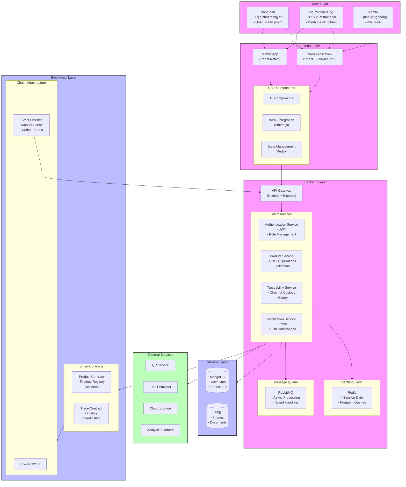

# System Architecture

The system architecture is designed with multiple layers to ensure scalability, security, and efficient data management.

## Architecture Diagram

## Key Components

1. User Layer
   - Farmers: Update information and manage products
   - Consumers: Track products and provide feedback
   - Admins: System management and approval

2. Frontend Layer
   - Web Application (React + TailwindCSS)
   - Mobile Application (React Native)
   - Core Components including Web3 integration