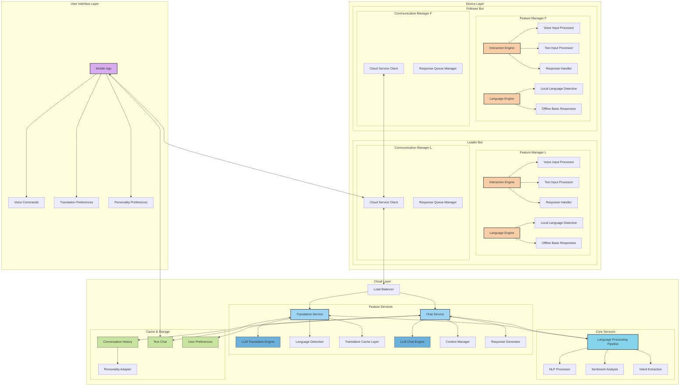

```mermaid
flowchart TB
    subgraph "Cloud Layer"
        subgraph "Feature Services"
            TS["Translation Service"]
            CS["Chat Service"]
            
            TS --> TLE["LLM Translation Engine"]
            TS --> LD["Language Detection"]
            TS --> TCL["Translation Cache Layer"]
            
            CS --> CCE["LLM Chat Engine"]
            CS --> CM["Context Manager"]
            CS --> RG["Response Generator"]
        end
        
        subgraph "Core Services"
            LPP["Language Processing Pipeline"]
            LPP --> NLP["NLP Processor"]
            LPP --> SA["Sentiment Analysis"]
            LPP --> IE["Intent Extraction"]
        end
        
        subgraph "Cache & Storage"
            CH["Conversation History"]
            TC["Translation Cache"]
            UP["User Preferences"]
            CH --> PA["Personality Adapter"]
        end
        
        LB["Load Balancer"]
        LB --> TS
        LB --> CS
        
        TS <--> LPP
        CS <--> LPP
        
        TS <--> TC
        CS <--> CH
        CS <--> UP
    end
    
    subgraph "Device Layer"
        subgraph "Leader Bot"
            subgraph "Feature Manager L"
                IEL["Interaction Engine"]
                LEL["Language Engine"]
                
                IEL --> VIPL["Voice Input Processor"]
                IEL --> TIPL["Text Input Processor"]
                IEL --> RHL["Response Handler"]
                
                LEL --> LLDL["Local Language Detection"]
                LEL --> OBRL["Offline Basic Responses"]
            end
            
            subgraph "Communication Manager L"
                CSCL["Cloud Service Client"]
                RQML["Response Queue Manager"]
            end
        end
        
        subgraph "Follower Bot"
            subgraph "Feature Manager F"
                IEF["Interaction Engine"]
                LEF["Language Engine"]
                
                IEF --> VIPF["Voice Input Processor"]
                IEF --> TIPF["Text Input Processor"]
                IEF --> RHF["Response Handler"]
                
                LEF --> LLDF["Local Language Detection"]
                LEF --> OBRF["Offline Basic Responses"]
            end
            
            subgraph "Communication Manager F"
                CSCF["Cloud Service Client"]
                RQMF["Response Queue Manager"]
            end
        end
        
        CSCL <--> LB
        CSCF <--> CSCL
    end
    
    subgraph "User Interface Layer"
        MA["Mobile App"]
        MA --> VC["Voice Commands"]
        MA --> TC["Text Chat"]
        MA --> TP["Translation Preferences"]
        MA --> PP["Personality Preferences"]
    end
    
    MA <--> CSCL
    
    style TS fill:#9fd5f4,stroke:#333,stroke-width:2px
    style CS fill:#9fd5f4,stroke:#333,stroke-width:2px
    style TLE fill:#6cb1db,stroke:#333,stroke-width:1px
    style CCE fill:#6cb1db,stroke:#333,stroke-width:1px
    style LPP fill:#85d4ec,stroke:#333,stroke-width:2px
    
    style IEL fill:#f8cea9,stroke:#333,stroke-width:2px
    style LEL fill:#f8cea9,stroke:#333,stroke-width:2px
    style IEF fill:#f8cea9,stroke:#333,stroke-width:2px
    style LEF fill:#f8cea9,stroke:#333,stroke-width:2px
    
    style CH fill:#c7e5a0,stroke:#333,stroke-width:1px
    style TC fill:#c7e5a0,stroke:#333,stroke-width:1px
    style UP fill:#c7e5a0,stroke:#333,stroke-width:1px
    
    style MA fill:#d8adf0,stroke:#333,stroke-width:2px
```